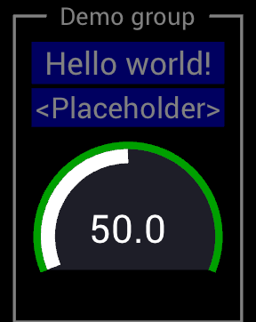
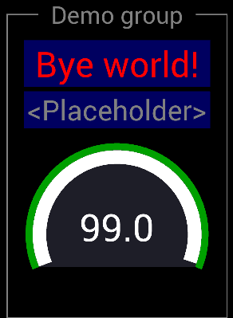

# gaugen;

Gaugen is a tool for composing simple, vector-based UIs with [rust](https://www.rust-lang.org/) and [nanovg-rs](https://github.com/KevinKelley/nanovg-rs). This current version is very preliminary.


>
>
>X-Plane 11 integration example.

## Usage

### Initialization
On startup, gaugen has to be provided with packages that contain components out of which our UI will be built:
```rust
gaugen::SessionBuilder::new()
        .register_components(gaugen::basic_components::components())
        .register_components(gaugen::geometry_components::components())
        .init(|session: &mut Session| {
            //here goes the drawing
        }
```
A component contains all the logic required for drawing particular types of UI elements. For example, on the X-Plane 11 demo, all the half-wheel-style indicators are drawn using _RotationalIndicator_ component from the _basic_components_ package.

### Layout definition

At the moment the only way to compose UI is trough JSON file, for example:
```json
{
    "type": "GroupingBox",
    "data": {
        "spacing": 0.95,
        "title": "Demo group",
        "title_size": {
            "RelativeToHeight": 0.1
        }
    },
    "children": [
        {
            "type": "Split",
            "data": {
                "direction": "Vertical"
            },
            "children": [
                {
                    "type": "TextField",
                    "name": "my_textfield",
                    "data": {
                        "text": "Hello world!"
                    }
                },
                {
                    "type": "TextField"
                },
                {
                    "type": "RotationalIndicator",
                    "name": "my_indicator"
                }
            ]
        }
    ]
}
```
will produce:



The components are organised into tree hierarchy. Each is configured either by component's default data (i.e. this rotational indicator being set _50_), by data supplied in the json (i.e. _GroupingBox_) or mix of both, json having of course priority over default data (i.e. "Hello World" _TextField_).

Layout can be then loaded and drawn:
```rust 
let mut view = session.new_view("screen.json").unwrap();

loop {
    [...]

    if !session.draw(&mut view, &frontend::DarkPalette {}, &HashMap::new()) {
        break; // handle window being closed, etc.
    }
}
```

### Hooks

Gaugen provides _hooks_ to enable overriding both the default data and the static-layout-data-from-json to allow for dynamic updating of the components.

```rust
let mut view = session.new_view("screen.json").unwrap();
let mut counter = 0;

loop {
    let mut hooks = gaugen::Hooks::new();

    gaugen::add_hook(&mut hooks, "my_textfield", "text", "Bye world!".to_string());
    gaugen::add_hook(&mut hooks, "my_textfield", "front_color", "ffff0000".to_string());
    gaugen::add_hook(&mut hooks, "my_indicator", "value", 99);

    if !session.draw(&mut view, &gaugen::frontend::DarkPalette {}, &hooks) {
        break; // handle window being closed, etc.
    }
}
```

Now this will produce:



## Creating new / custom components


Each component type must provide three data models:
```rust
impl gaugen::Component<GroupingBoxData, GroupingBoxInternalData> for GroupingBox {
    [...]
}
```

In this case, _GroupingBox_ contains all the data shared between all instances of grouping boxes. Those can be, for example, a background texture common to all grouping boxes.

_GroupingBoxData_ on the other hand provides data specific to a particual instance of some grouping box on the screen. This is to provide all of the high-level configuration of the component, such as padding (i.e. 5%), or tittle (i.e. "SYSTEMS"). Because it will be supplied in a dynamic manner, it is required to be serializable. This is refered as _public data_.

_GroupingBoxInternalData_ takes care of storing mutable, internal, non-serializable state for each instance. For grouping boxes this is used to cache intermediate geometry calculations instead of repeating them on each frame.

Once data model is provided, necessary component's logic must be defined, in particular initialization of a new instance, so gaugen can turn any _public data_ into new component's instance:
```rust
impl gaugen::Component<GroupingBoxData, GroupingBoxInternalData> for GroupingBox {
    fn init_instance(
        &self,
        __ctx: &frontend::PresentationContext,
        data: &GroupingBoxData,
        children_sizes: &[gaugen::ControlGeometry],
    ) -> gaugen::AfterInit<GroupingBoxInternalData> {
        [...]
    }
}
```

And of course a drawing action, so gaugen can actually order drawing of particular instances:
```rust
impl gaugen::Component<GroupingBoxData, GroupingBoxInternalData> for GroupingBox {
    fn draw(
        &self,
        ctx: &frontend::PresentationContext,
        zone: gaugen::DrawZone,
        children: &mut [Box<dyn FnMut(gaugen::DrawZone) + '_>],
        internal_data: &mut GroupingBoxInternalData,
        public_data: &GroupingBoxData,
    ) {
        [...]
    }
}
```

_basic_components_ and _geometry_components_ are provided with gaugen and contain all the components used in examples and can be used as examples themselves when creating new components.

## Work in progress
 - example allowing for exploration of data models of the avalible components
 - input handling
 - abstract and document geometrical coupling between parents & children
 - elimite all hard-coded colors from basic components
 - resource management (i.e. fonts)